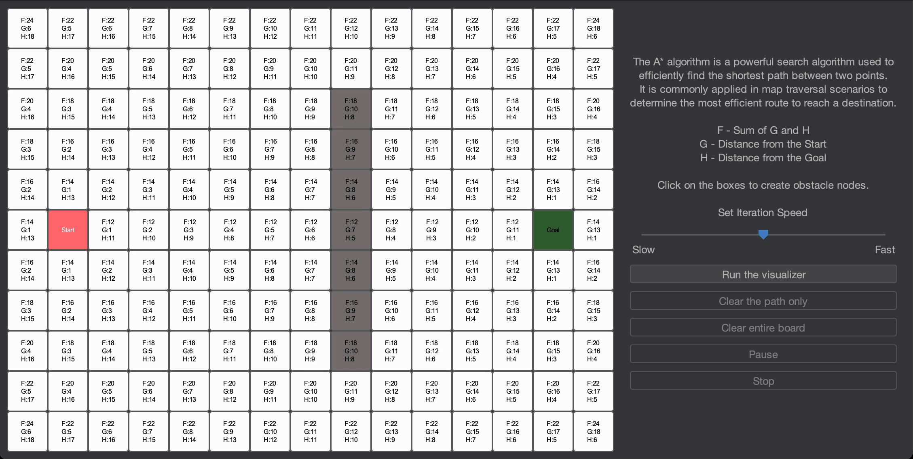

# A* Algorithm Visualizer



## Introduction

A * algorithm is a searching algorithm that searches for the shortest path between the initial and the final state.
The algorithm used in various applications, such as maps, in which the A* algorithm calculates the shortest distance
between the source (initial state) and the destination (final state).

## Features

- Interactive grid-based environment
- Place obstacles on the grid
- Visualize the A* algorithm in action
- Pause and resume the visualization
- Modify the iteration speed
- See optimal path highlighted

## Prerequisites

- Java Development Kit (JDK) installed
- Java Swing library

## Running The Program Through Command Line (Double Click Alternative)

1. Download AStarVisualizer.jar from this repository's releases. <br/>

   <a href="https://github.com/SyntaxWarrior30/A-Star-Algorithm-Visualizer/releases/tag/v1.0.0"><a/>

2. In the terminal, enter the directory where the AStarVisualizer.jar is downloaded. <br/>
For example, all my downloaded files are inside the downloads folder, so I would enter the downloads directory.
    ``` bash
    cd downloads
    ```
3. Then run the command below to run the AStarVisualizer.jar file.
    ``` bash
    java -jar AStarVisualizer.jar
    ```

## License
This project is licensed under the MIT License. Feel free to use and modify the code for your own purposes.